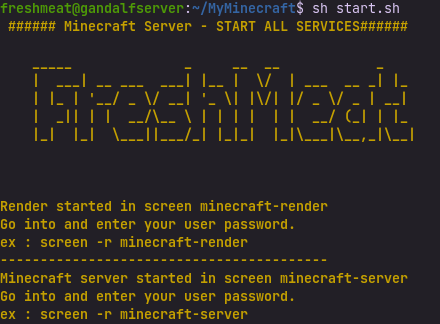
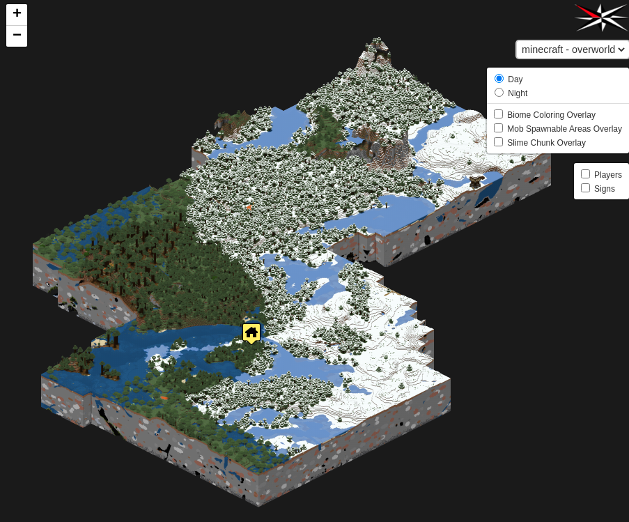

# MyMinecraft
My minecraft is a tool for minecraft server and more... 

# Thanks
This tool is based on work of :
- https://github.com/itzg/docker-minecraft-server : Minecraft Server Docker image
- https://github.com/mide/minecraft-overviewer : Minecraft Overview render Docker image

Thank's to them

## What is MyMinecraft?
My minecraft can be usefull if you want your own minecraft by executing one command.
It lauch :
- a Minecraft server (lastest version)
- a Web server for Minecraft Overview. (a map of your world's server)

All services are in container, using Docker engine.

!BEWARE! The tool only works for a debian linux distribution (like ubuntu).

## Dependencies
The tool needs :
- Docker
- Docker-compose
- Curl
- screen

If they aren't install, don't worry. They will be automatically install at first lauch.

## Configuration
Before running MyMinecraft, you need to configure it.
overwrite the file ".env" in the MyMinecraft directory to change the configuration
`nano .env`
The documentation for environnement variables are here : https://github.com/itzg/docker-minecraft-server#server-configuration

## Installation
It's simple...\n
`sh install.sh`

It will
- 1° Check the dependencies
- 2° Lauch the minecraft server
- 3° Lauch the process to render the server's map and lauch the web server to access it.

## Command
### Stop
To stop the minecraft server and the web server : 
`sh stop.sh`

### Update map
To update the map, run
`sh update_render.sh`

!DISCLAMER! It will stop your minecraft server, relauched at the end of the process.

### Restart web server
To restart only webserve, run
`sh docker/run_web_server.sh`

### Restart minecraft server
To restart only webserve, run
`sh docker/start_server.sh`

Do it in the good screen.

### Screens
The minecraft server and the Render are lauch in separed linux screen. In this way if you close your terminal, the process isn't killed.
To access to screens :
- For Minecraft server : `screen -r minecraft-server` -> Display Minecraft server information 
- For Render process/web server : `screen -r minecraft-render` -> Display render process

To quit a screen on linux : type "^C+a" , than type "d"
To scroll a screen on linux : type "^C+a" , than type "esc" (type esc again to come back at bottom)

NB : At the end for render and when the web server will be ready, minecraft-render screen will be useless and quit.

## Web server
When render is over, you can access to our server map on your computer
http://localhost:8080/

